# Women in Hollywood ROI

A supervised machine learning model and interactive web dashboard that proves female-led films are profitable investments — countering the Hollywood narrative that "women don't sell."

Built at **NOD Coding Stockholm**.

---

## Screenshots

### Tab 1 — Hero
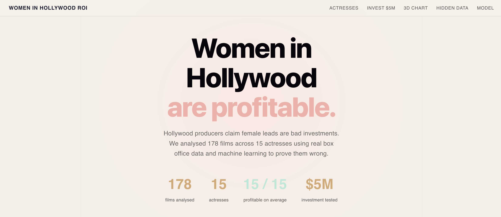

### Tab 2 — Actress ROI Cards
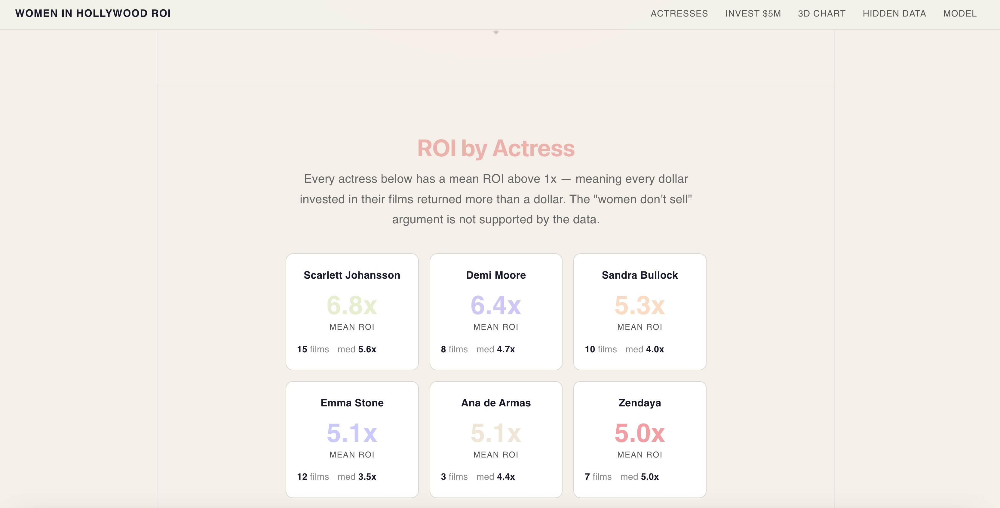
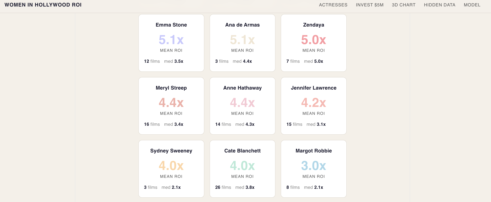
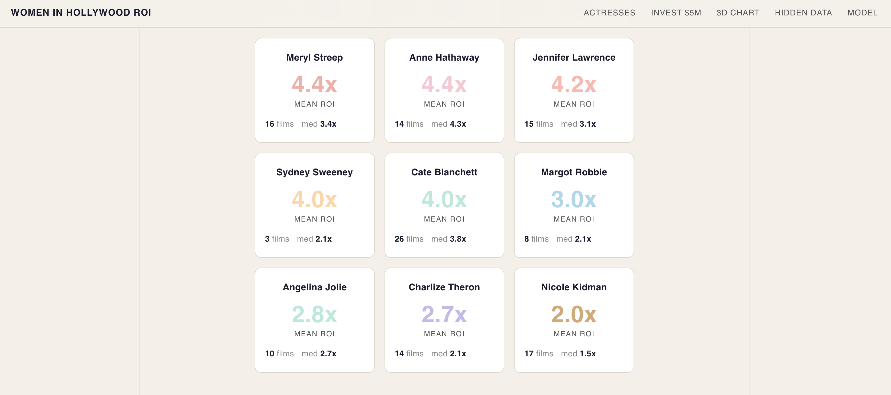

### Tab 3 — $5M Investment Calculator
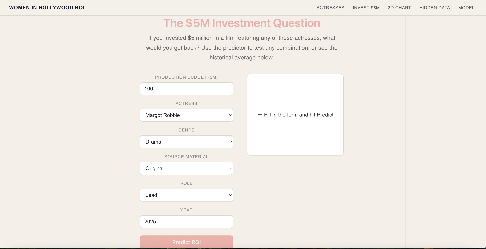
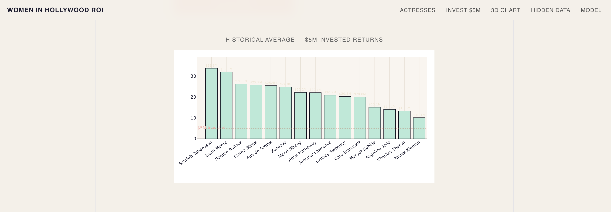

### Tab 4 — 3D Budget / Gross / ROI Chart
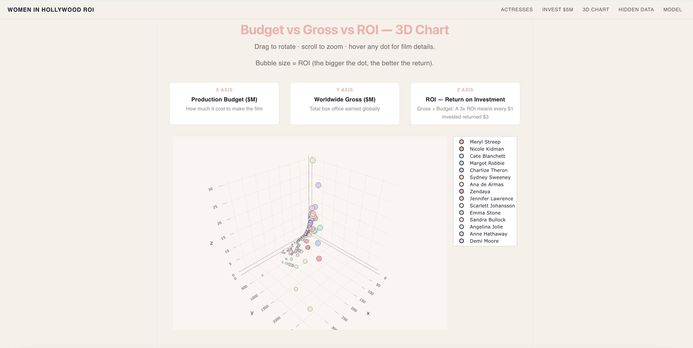

### Tab 5 — The Hidden Data Argument
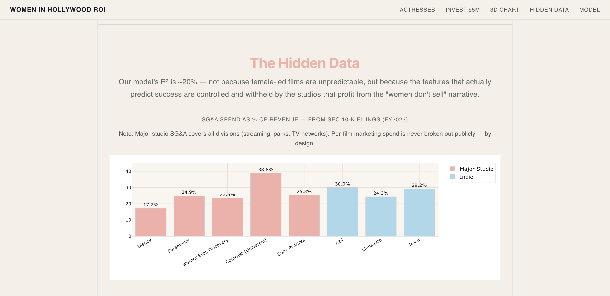
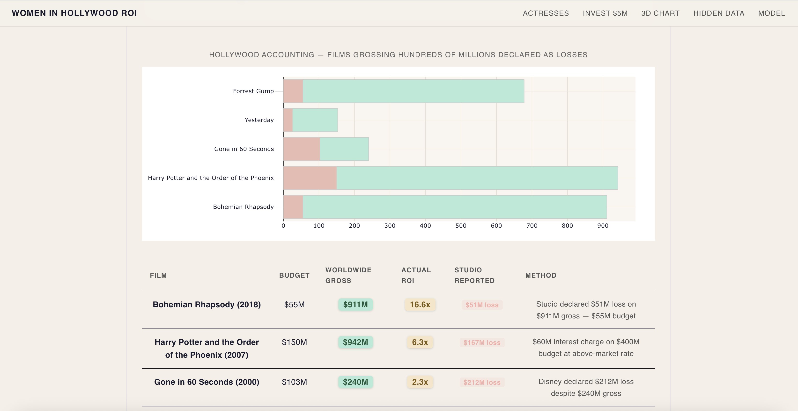
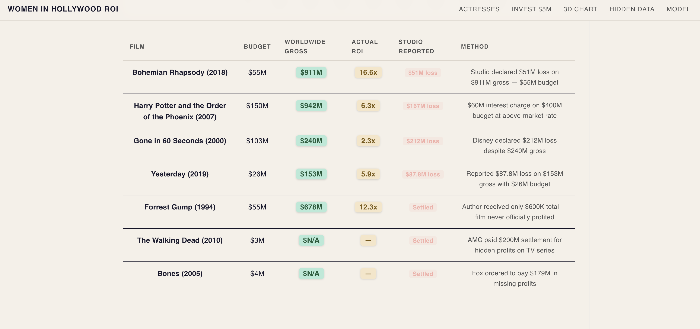

### Tab 6 — Model Scores
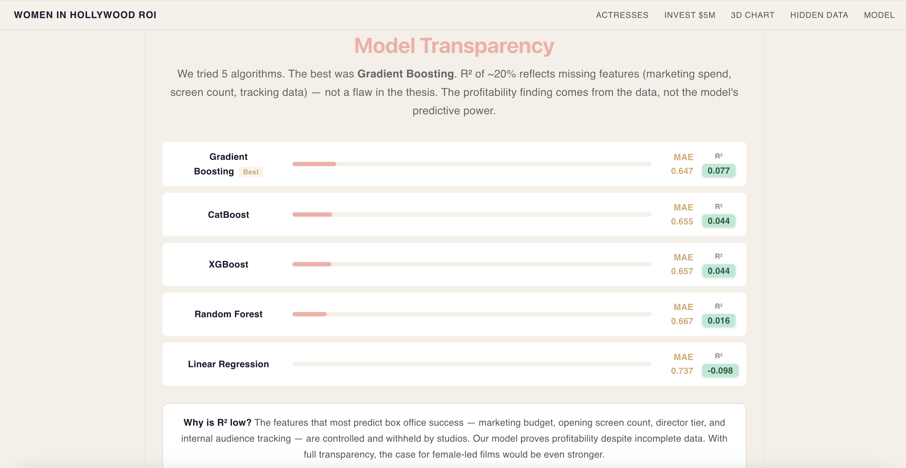

---

## The Thesis

Hollywood producers routinely claim that casting women as leads is a financial risk. This project uses real box office data, SEC financial filings, and machine learning to dismantle that argument across three layers:

1. **ROI data** — every actress in this dataset has a mean ROI above 1x across their theatrical filmography
2. **$5M investment model** — a trained ML model predicts returns on any hypothetical film
3. **The hidden data argument** — the model's R² (~20%) is itself evidence of structural data suppression; the features most predictive of box office success (marketing spend, screen count, tracking data) are controlled and withheld by the same studios that profit from the "women don't sell" narrative

---

## Dataset

**178 theatrical films · 15 actresses · FY1990–2024**

| Actress | Films |
|---|---|
| Cate Blanchett | 26 |
| Meryl Streep | 16 |
| Nicole Kidman | 17 |
| Jennifer Lawrence | 15 |
| Scarlett Johansson | 15 |
| Anne Hathaway | 14 |
| Charlize Theron | 14 |
| Emma Stone | 12 |
| Sandra Bullock | 10 |
| Angelina Jolie | 10 |
| Zendaya | 7 |
| Margot Robbie | 8 |
| Ana de Armas | 3 |
| Sydney Sweeney | 3 |
| Demi Moore | 8 |

**Sources:** Variety · Deadline · The Hollywood Reporter · Wikipedia (verified per film) · SEC EDGAR 10-K filings (Disney, Paramount, Warner Bros. Discovery, Comcast)

### What is SEC EDGAR?

**EDGAR** (Electronic Data Gathering, Analysis, and Retrieval System) is the U.S. Securities and Exchange Commission's free public database. Every company listed on the US stock market is legally required to file their financial documents there — including annual reports (10-K) and quarterly reports (10-Q).

Because Disney, Warner Bros. Discovery, Paramount, and Comcast are all publicly traded, their financial disclosures are public record. We used their **10-K annual reports** to extract total Selling, General & Administrative (SG&A) expenses — the line item that includes marketing spend:

| Studio | Annual SG&A | Revenue | SG&A % of Revenue |
|---|---|---|---|
| Disney | $15.3B | $88.9B | 17% |
| Paramount | $7.4B | $29.7B | 25% |
| Warner Bros. Discovery | $9.7B | $41.3B | 23% |
| Comcast (Universal) | $47.2B | $121.6B | 39%* |

*Comcast figure includes cable, broadband, and NBC — not film only.

**The critical gap:** Studios report total SG&A across all divisions. They are not legally required to break out marketing spend per individual film. This is deliberate — per-film marketing data would reveal exactly how much (or how little) each film was supported before release. A female-led film that received $20M in marketing will always underperform a comparable male-led film that received $150M — and the studio will point to the box office difference as proof "women don't sell." EDGAR proves the studios have the data. The fact that they don't report it at the film level is the structural bias this project is designed to expose.

**Target variable:** ROI = worldwide gross / production budget

---

## Tech Stack

### Backend — Python
| Library | Purpose |
|---|---|
| `FastAPI` | REST API — 7 endpoints serving data and predictions |
| `scikit-learn` | ML Pipeline, preprocessing, GridSearchCV |
| `CatBoost` | Best-performing model — handles categoricals natively |
| `XGBoost` | Compared model — regularised gradient boosting |
| `GradientBoostingRegressor` | sklearn baseline boosting |
| `RandomForestRegressor` | Ensemble comparison |
| `LinearRegression` | Baseline model |
| `pandas` + `numpy` | Data processing |
| `joblib` | Model persistence |

### Frontend — JavaScript
| Library | Purpose |
|---|---|
| `React` | UI framework |
| `Vite` | Build tool and dev server |
| `Framer Motion` | Scroll animations, stagger effects, transitions |
| `Plotly.js` | Interactive charts including 3D scatter |
| `react-plotly.js` | React wrapper for Plotly |
| `Axios` | HTTP requests to FastAPI |

---

## Project Structure

```
Women in Hollywood ROI/
├── CLAUDE.md                         — AI coding instructions
├── SKILLS.md                         — Reusable patterns and conventions
│
├── backend/
│   ├── requirements.txt
│   ├── data/
│   │   ├── raw/
│   │   │   ├── films.csv             — 178 films, raw dataset
│   │   │   ├── studio_marketing.csv  — SEC 10-K SG&A data by studio
│   │   │   └── hollywood_accounting.csv — documented accounting manipulation cases
│   │   └── processed/
│   │       ├── films_clean.csv       — theatrical films with ROI calculated
│   │       ├── results.csv           — test-set predictions
│   │       └── model_scores.csv      — cross-val comparison of all 5 models
│   ├── notebooks/
│   │   └── 01_eda.ipynb              — EDA: 13 sections including Hidden Data analysis
│   ├── src/
│   │   └── train.py                  — Pipeline, 5 models, GridSearchCV, evaluation
│   ├── api/
│   │   └── main.py                   — FastAPI server
│   └── models/
│       └── best_model.pkl            — Saved best model (joblib)
│
└── frontend/
    ├── vite.config.js
    └── src/
        ├── App.jsx                   — Main app, data fetching, layout
        ├── App.css                   — Global styles (cream palette)
        └── components/
            ├── Hero.jsx              — Animated hero with live stats
            ├── ActressCards.jsx      — Staggered ROI cards per actress
            ├── InvestmentCalc.jsx    — $5M predictor + historical bar chart
            ├── ScatterPlot3D.jsx     — Rotatable 3D budget/gross/ROI chart
            ├── HiddenData.jsx        — SEC filings + Hollywood accounting
            └── ModelScores.jsx       — Model comparison with animated bars
```

---

## How to Run

### 1. Backend

```bash
cd backend
pip install -r requirements.txt

# Train the model (generates processed data + best_model.pkl)
python src/train.py

# Start the API at http://localhost:8000
uvicorn api.main:app --reload
```

### 2. Frontend (separate terminal)

```bash
cd frontend
npm install
npm run dev
# Opens at http://localhost:5173
```

---

## API Endpoints

| Endpoint | Method | Returns |
|---|---|---|
| `/` | GET | Health check |
| `/actresses` | GET | Mean ROI, $5M return per actress |
| `/films` | GET | All 178 theatrical films with ROI |
| `/model-scores` | GET | Cross-val MAE + R² for all 5 models |
| `/studios` | GET | SEC 10-K SG&A data by studio |
| `/accounting` | GET | Hollywood accounting manipulation cases |
| `/predict` | POST | Predicted ROI for a new film |

---

## ML Pipeline

```
Raw data → EDA (01_eda.ipynb)
         → films_clean.csv
         → train/test split (80/20, stratified on ROI bins)
         → ColumnTransformer (StandardScaler + OneHotEncoder)
         → GridSearchCV cv=5 across 5 models
         → Best model evaluated on test set ONCE
         → Saved to models/best_model.pkl
```

**Features:** `budget_m`, `year`, `actress`, `genre`, `source`, `role`  
**Target:** `log(ROI)` — log-transformed to handle right-skewed distribution

---

## Key Findings

| Finding | Evidence |
|---|---|
| All 15 actresses profitable on average | Mean ROI > 1x for every actress |
| $5M invested returns a profit in every case | Minimum ~$10M return historically |
| Scarlett Johansson highest mean ROI at 6.75x | 15 films analysed |
| Low-budget originals outperform IP on ROI | Monster ($8M → 7.5x) vs blockbusters |
| R² ~20% reflects missing data, not female lead risk | Marketing spend + screen count are hidden |
| Bohemian Rhapsody: $911M gross declared as $51M loss | Hollywood accounting is documented and real |

---

## NOD Requirements Checklist

- [x] Real dataset, not synthetic
- [x] Regression — clearly stated (target: ROI)
- [x] EDA of features and target variable (13 sections)
- [x] Baseline model defined (Linear Regression)
- [x] Train/test split (80/20 stratified)
- [x] Preprocessing: scaling, OneHotEncoding, imputation
- [x] At least 4 models tried (5 models)
- [x] GridSearchCV with K-fold cross validation (cv=5)
- [x] Final model evaluated on test data once
- [ ] Trello board
- [x] GitHub with README
